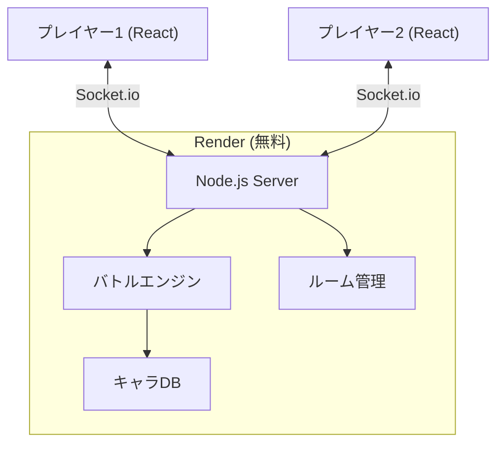

# Oregashima Battle Stadium!! 実装プラン計画

Oregashimaメンバーを使ったポケモン型オンライン対戦バトルゲーム。

## User Review Required

> [!IMPORTANT]
> ゲームルール・キャラクター設計・タイプ相性の方向性について承認をお願いしたい。

> [!IMPORTANT]
> プロジェクト名を決定したい。仮称「Oregashima-battle」として進める。

---

## ゲームシステム設計

### 基本ルール
- **対戦形式**: プレイヤーの好みに合わせて、ルーム作成時に以下の2つのモードから選択できる。
    1. **シングルバトル（1vs1・控え2体）**: ポケモン形式。交代と読み合いがメイン。
    2. **トリプルバトル（3vs3・同時戦闘）**: ロマサガやドラクエ形式。全体のコンボとターゲット指定がメイン。
- **選出方式**: 全10名のキャラクターの中から、各プレイヤーが**好きな3体を自由に選出**する。
    - シングルバトルの場合は「出す順番（先発・中堅・大将）」を決定する。
    - トリプルバトルの場合は「配置（前衛・後衛など）」を決定（今後の拡張）。
- **勝利条件**: 相手の3体を全て倒す
- **各キャラHP**: 100
- **ターン**: 同時選択制（シングルは1手、トリプルは3手を選択後、全員の素早さ順に処理）

### デュアルタイプ・システム

各キャラクターは**「精神属性」**と**「元素属性」**の2つの属性を併せ持つ。
技（攻撃）は**いずれか1つの属性**を持ち、防御側の該当する系統の属性に対して倍率計算を行う。

**1. 精神サイクル (Mental Cycle)**
- **闇 (Darkness)**: 混沌に強く、光に弱い。
- **光 (Light)**: 闇に強く、混沌に弱い。
- **混沌 (Chaos)**: 光に強く、闇に弱い。
*(相性: 闇 → 混沌 → 光 → 闇)*

**2. 元素サイクル (Elemental Cycle)**
- **炎 (Fire)**: 氷に強く、雷に弱い。
- **氷 (Ice)**: 雷に強く、炎に弱い。
- **雷 (Thunder)**: 炎に強く、氷に弱い。
*(相性: 炎 → 氷 → 雷 → 炎)*

#### ダメージ計算
```
基本ダメージ = 技の威力 × (ATK / DEF) × 相性倍率
```
- **弱点 (弱点):** 攻�## キャラクター設計 (10名)

各キャラクターは「精神属性」1つと「元素属性」1つを持つ。

### すぱろー
> *静寂と硝煙……それが、俺の選んだドレスコードだ。*
- **精神属性**: 闇 / **元素属性**: 氷
- **ATK**: 100 / **DEF**: 30 / **SPD**: 100 (極限の超速アタッカー)

| 技名                               | 属性 | 威力 | SP   | 効果                                |
| :--------------------------------- | :--- | :--- | :--- | :---------------------------------- |
| 沈黙のダブル・ウイスキー           | 闇   | 20x2 | 0    | 2回連続攻撃                         |
| 氷の微笑（オン・ザ・ロックス）     | 氷   | 60   | 1    | 20%の確率で相手を「凍結」させる     |
| あばよ、相棒（アディオス・バディ） | 闇   | 150  | 4    | 超極大ダメージ。使用後、自分のHPは1になる |
| **[パッシブ] 背水のダンディズム**  | -    | -    | -    | 自分のHPが1の時、ATKとSPDが2倍になる |

---

### アーリエス
> *ゲームとロボットが人生。アリラジもよろしく！*
- **精神属性**: 混沌 / **元素属性**: 炎
- **ATK**: 85 / **DEF**: 65 / **SPD**: 70 (バランス型)

| 技名                        | 属性 | 威力 | SP   | 効果                               |
| :-------------------------- | :--- | :--- | :--- | :--------------------------------- |
| ゲーミング・バースト        | 炎   | 35   | 0    | 通常攻撃                           |
| 魔改造・ロマン武装          | 混沌 | 55   | 1    | 相手の防御力を一部無視して攻撃     |
| アリラジ公開録音            | 炎   | 75   | 2    | 相手を「炎上」状態にする(持続ダメ) |
| **[パッシブ] 生放送の熱狂** | -    | -    | -    | 自分が状態異常の時、ATKが20%上昇   |

---

### CELL
> *ホラーとバーガーとボカロ。忍ツボ始めました*
- **精神属性**: 混沌 / **元素属性**: 雷
- **ATK**: 75 / **DEF**: 60 / **SPD**: 90 (妨害/高速型)

| 技名                            | 属性 | 威力 | SP   | 効果                                   |
| :------------------------------ | :--- | :--- | :--- | :------------------------------------- |
| 尊死の断末魔                    | 混沌 | 30   | 0    | 通常攻撃                               |
| 解釈違いの過負荷                | 雷   | 0    | 1    | 2ターンの間, 相手のATKを下げる         |
| 地雷原の踏破                    | 混沌 | 60   | 2    | 30%の確率で相手を「混乱」させる        |
| **[パッシブ] 解釈一致の眼差し** | -    | -    | -    | ターン開始時に相手が選択した技が見える |

---

### ちゃーこ
> *鉱物、宝石大好き。石と推し*
- **精神属性**: 光 / **元素属性**: 氷
- **ATK**: 55 / **DEF**: 95 / **SPD**: 60 (タンク/守護型)

| 技名                          | 属性 | 威力 | SP   | 効果                                      |
| :---------------------------- | :--- | :--- | :--- | :---------------------------------------- |
| 推しカプの結晶                | 氷   | 25   | 0    | 攻撃しつつ、自分のDEFを10%上げる          |
| 限界ヲタクの礼賛              | 光   | 0    | 1    | 自分のHPを30回復する                      |
| 聖地巡礼の奇跡                | 氷   | 100  | 3    | 必中攻撃。相手のDEFを20%下げる            |
| **[パッシブ] 揺るがぬカプ愛** | -    | -    | -    | 交代で場に出た最初のターン、被ダメ30%軽減 |

---

### やもり
> *自分はなんにもしてないよ、いいんじゃない？って言っただけ*
- **精神属性**: 闇 / **元素属性**: 雷
- **ATK**: 75 / **DEF**: 70 / **SPD**: 75 (持続ダメ型)

| 技名                                | 属性 | 威力 | SP   | 効果                                |
| :---------------------------------- | :--- | :--- | :--- | :---------------------------------- |
| 適当な相槌                          | 雷   | 30   | 0    | 通常攻撃                            |
| 無自覚な猛毒                        | 闇   | 25   | 1    | 相手を「猛毒」状態にする            |
| シャーク・お昼寝・ボルト              | 雷   | 65   | 2    | 20%の確率で相手を「麻痺」させる     |
| **[パッシブ] 「いいんじゃない？」** | -    | -    | -    | 状態異常の相手へのダメージが20%上昇 |

---

### きさらぎどーじ
> *俺が島のアイドル、どーじさんです*
- **精神属性**: 混沌 / **元素属性**: 炎
- **ATK**: 80 / **DEF**: 60 / **SPD**: 80 (速攻型)

| 技名                          | 属性 | 威力 | SP   | 効果                              |
| :---------------------------- | :--- | :--- | :--- | :-------------------------------- |
| 俺ちゃんオンステージ          | 炎   | 35   | 0    | 通常攻撃                          |
| 究極のファンサ                | 混沌 | 50   | 1    | 30%の確率で相手のSPDを下げる      |
| 俺が島の頂上決戦              | 炎   | 120  | 3    | 高威力だが命中75%。外すと反動ダメ |
| **[パッシブ] 不滅のアイドル** | -    | -    | -    | 味方が最後1体の時、全ステ↑        |

---

### ゆきしろ
> *ゆきしろきつねといいます。仲良くしてください*
- **精神属性**: 光 / **元素属性**: 氷
- **ATK**: 60 / **DEF**: 75 / **SPD**: 80 (サポート型)

| 技名                      | 属性 | 威力 | SP   | 効果                                  |
| :------------------------ | :--- | :--- | :--- | :------------------------------------ |
| 白狐の粉雪                | 氷   | 30   | 0    | 通常攻撃                              |
| 狐の恩返し                | 光   | 0    | 1    | HPを20回復し、全ての状態異常を解除    |
| 月夜の狐火                | 光   | 0    | 2    | 2ターンの間、受けるダメージを半減する |
| **[パッシブ] 瑞兆の予報** | -    | -    | -    | ターン終了時に10%の確率でSP+1         |

---

### まるはち
> *創作、映画、ゲーム、怖がる人間さん推し*
- **精神属性**: 混沌 / **元素属性**: 雷
- **ATK**: 85 / **DEF**: 55 / **SPD**: 75 (トリッキー型)

| 技名                        | 属性 | 威力 | SP   | 効果                                 |
| :-------------------------- | :--- | :--- | :--- | :----------------------------------- |
| 妄想の暴走                  | 混沌 | 35   | 0    | 通常攻撃                             |
| 自給自足の筆致              | 雷   | 40   | 1    | 25%で相手を混乱や暗闇にする          |
| 禁断の二次創作              | 混沌 | 0    | 2    | 相手の最後に出した技をコピーして放つ |
| **[パッシブ] 沼落ちの誘い** | -    | -    | -    | 状態異常の相手に技威力+15%           |

---

### 伍長
> *部下の尻を拭くのは上官の義務だ……たとえこの身が擦り切れても。*
- **精神属性**: 光 / **元素属性**: 炎
- **ATK**: 95 / **DEF**: 85 / **SPD**: 40 (不屈の重戦車)

| 技名 | 属性 | 威力 | SP | 効果 |
| :--- | :--- | :--- | :--- | :--- |
| 献身の鉄拳 | 炎 | 50 | 0 | 強力な通常攻撃。自分も10ダメージ受ける |
| 捨て身の鬼教練 | 炎 | 75 | 1 | 高威力攻撃。自分も20ダメージ受ける |
| 命を賭した尻拭い | 光 | 0 | 4 | 味方全体のHPを回復し全状態異常を解除。自分は35ダメージ受ける |
| **[パッシブ] 削り出される闘志** | - | - | - | 自分のHPが低いほど、ATKとDEFが上昇する |

---

### 闇伍長
> *伍長の中に眠る負の感情が実体化した姿*
- **精神属性**: 闇 / **元素属性**: 炎
- **ATK**: 115 / **DEF**: 45 / **SPD**: 60 (超火力アタッカー)

| 技名                        | 属性 | 威力 | SP   | 効果                                 |
| :-------------------------- | :--- | :--- | :--- | :----------------------------------- |
| 絶望の叙事詩                | 闇   | 40   | 0    | 通常攻撃                             |
| 終わりなき後始末            | 炎   | 55   | 1    | 相手の防御を一部無視して攻撃         |
| 尻拭いのプライド            | 闇   | 110  | 3    | 極大ダメージ。自分も15ダメージ受ける |
| **[パッシブ] 壊れた指揮棒** | -    | -    | -    | 自分のHPが半分以下の時、ATK1.5倍     |

---

## 属性分布まとめ

| 系統     | 属性     | キャラクター                       | キャラ数 |
| :------- | :------- | :--------------------------------- | :------- |
| **精神** | **闇**   | すぱろー、やもり、闇伍長           | 3        |
|          | **光**   | ちゃーこ、ゆきしろ、伍長           | 3        |
|          | **混沌** | アーリエス、CELL、どーじ、まるはち | 4        |
| **元素** | **炎**   | アーリエス、どーじ、伍長、闇伍長   | 4        |
|          | **氷**   | すぱろー、ちゃーこ、ゆきしろ       | 3        |
|          | **雷**   | CELL、やもり、まるはち             | 3        |

---


## 技術構成

### アーキテクチャ
Express + Socket.io + Render（無料）。murder-mysteryと同じ実績ある構成。



### プロジェクト構成

```
c:\Users\sujak\Desktop\hobby\GitHub\Oregashima-battle/
├── client/                        # React + Vite
│   ├── src/
│   │   ├── components/
│   │   │   ├── Lobby.tsx          # ロビー（ルーム作成/参加）
│   │   │   ├── TeamSelect.tsx     # パーティ編成画面
│   │   │   ├── BattleField.tsx    # バトル画面
│   │   │   ├── CharacterCard.tsx  # キャラ表示
│   │   │   ├── MoveSelect.tsx     # 技選択UI
│   │   │   ├── HPBar.tsx          # HPバー
│   │   │   └── BattleLog.tsx      # バトルログ
│   │   ├── hooks/
│   │   │   └── useSocket.ts
│   │   ├── App.tsx
│   │   ├── App.css
│   │   └── main.tsx
│   ├── public/assets/             # キャラ画像
│   ├── index.html
│   ├── vite.config.ts
│   └── package.json
├── server/                        # Node.js + Express + Socket.io
│   ├── src/
│   │   ├── engine/
│   │   │   ├── BattleEngine.ts    # バトル処理メイン
│   │   │   ├── DamageCalc.ts      # ダメージ計算
│   │   │   ├── StatusEffects.ts   # 状態異常処理
│   │   │   └── TypeChart.ts      # タイプ相性表
│   │   ├── data/
│   │   │   ├── characters.ts      # 10キャラデータ
│   │   │   └── moves.ts           # 全技データ
│   │   ├── rooms/
│   │   │   └── RoomManager.ts
│   │   ├── types.ts
│   │   └── server.ts
│   ├── tsconfig.json
│   └── package.json
├── render.yaml
├── .gitignore
└── README.md
```

### 拡張性

| 展開先       | 方針                                           |
| ------------ | ---------------------------------------------- |
| Steam        | Tauri でラップ（murder-mystery実績あり）       |
| スマホ       | PWA or Capacitor                               |
| 新キャラ追加 | `characters.ts` と `moves.ts` にデータ追加のみ |
| ランク戦     | Phase 2 以降でレーティングシステム追加         |

---

## 開発フェーズ

まずは確証の高い「1vs1」から実装し、その後「3vs3」の複雑なシステムを段階的に導入する。

### Phase 1: MVP（シングルバトル完成）
- プロジェクト初期化（GitHub, Vite, Express）
- 10キャラ+全技データ定義
- バトルエンジン（1vs1のダメージ計算、タイプ相性、ターン処理）
- Socket.io通信（ルーム、技選択同期）
- 基本UI（ロビー、パーティ選択、1vs1用バトル画面）

### Phase 2: モード拡張（トリプルバトル追加）
- ルーム作成時の「モード選択（1vs1 / 3vs3）」UI
- バトルエンジンの拡張（ターゲット指定、全体攻撃、3キャラ同時ターン処理）
- 3vs3用のバトル画面レイアウト（6体表示）
- ステータス異常・パッシブスキルのシナジー調整

### Phase 3: 演出・UX強化
- バトルアニメーション、エフェクト、サウンド
- キャラクターイラスト差し替え

### Phase 4: 機能拡張
- 対CPU戦（AI）
- 戦績記録・ランキング
- 観戦モード

---

## Verification Plan

### 手動検証（Phase 1）
1. サーバー/クライアント起動 → ロビー表示
2. ルーム作成・参加 → 2人マッチ成立
3. パーティ3体選出 → 相互に確認
4. バトル開始 → 技選択 → ダメージ計算正常
5. タイプ相性 → 倍率が正しくかかる
6. パッシブスキル → 条件発動を確認
7. HP0 → 次キャラ交代 → 3体倒して勝利
