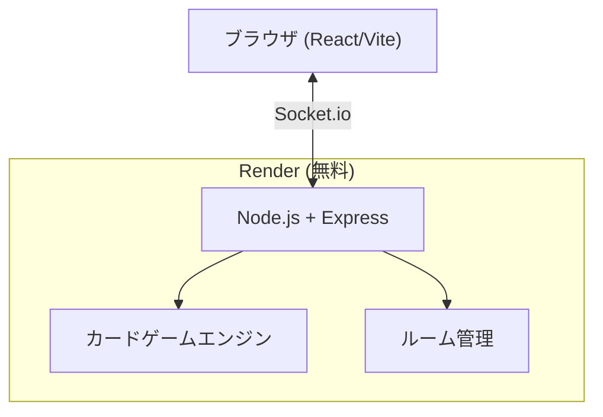

# オンラインカードゲーム技術検討レポート

## 概要

ゴッドフィールド風のオンライン対戦カードゲームを、Oregashima_blogのメンバーをキャラクターとして、無料インフラで実現するための技術検討。

---

## 1. 現状の資産

### 既存カードゲーム（Oregashima_blog内）
- **完成度**: 95%（ラブレター系ルール、10種のキャラカード）
- **技術スタック**: Astro + Svelte + TypeScript + Tailwind CSS
- **通信方式**: HTTP ポーリング（2秒間隔）
- **残課題**: WebSocket化、本番環境構築

### murder-mystery（オンライン対戦の参考）
- **技術スタック**: React(Vite) + Express + Socket.io + TypeScript
- **ホスティング**: Render（無料プラン）
- **特徴**: Socket.ioによるリアルタイム双方向通信、ルーム管理、再接続対応、観戦モード

### メンバー（9名）
すぱろー、アーリエス(aceriasun)、CELL、ちゃーこ、伍長(gocho)、如月(kisaragi)、まるはち、やもり、ゆっきー(yukishiro)

---

## 2. ゴッドフィールド型 vs 既存カードゲーム

| 要素 | 既存（ラブレター系） | ゴッドフィールド型 |
|------|---------------------|-------------------|
| HP制 | なし（脱落制） | あり（HP管理） |
| カード種別 | 10種（1機能/カード） | 武器・防具・奇跡・アイテムの4カテゴリ |
| ターン構造 | 引く→出す | 攻撃ターン/防御ターンの分離 |
| デッキ | 共有山札 | 個人手札（ランダム配布） |
| 属性システム | なし | あり（火・水等） |
| 状態異常 | なし | あり（病気・幻覚等） |
| ゲーム時間 | 5-15分 | 10-30分 |
| 実装量 | ★★☆ | ★★★★★ |

> [!IMPORTANT]
> ゴッドフィールド型は既存カードゲームとは**全く異なるゲームシステム**。エンジンの流用は難しく、ほぼゼロからの設計が必要。

---

## 3. アーキテクチャ案

### 案A: Express + Socket.io + Render（推奨）
murder-mysteryと同じ構成。実績あり、最もスムーズ。



| 項目 | 詳細 |
|------|------|
| フロント | React + Vite + TypeScript |
| バックエンド | Node.js + Express + Socket.io |
| ホスティング | Render 無料プラン |
| 費用 | **$0** |
| 制約 | 15分無活動でスリープ、初回アクセスに30-60秒の起動待ち |
| 実績 | murder-mysteryで運用済み |

### 案B: Cloudflare Workers + Durable Objects
既存カードゲームで計画していた構成。

| 項目 | 詳細 |
|------|------|
| フロント | Astro/Svelte or React |
| バックエンド | Cloudflare Workers + Durable Objects |
| WebSocket | Durable Objects のWebSocket API |
| 費用 | 無料枠内（10万リクエスト/日） |
| 制約 | Durable Objects は有料プラン必須（$5/月〜） |

> [!WARNING]
> Durable Objects は Cloudflare の有料プラン（Workers Paid, $5/月〜）が必要。**完全無料では不可能**。

### 案C: GCP Cloud Run + WebSocket
GCPアカウントを活用。

| 項目 | 詳細 |
|------|------|
| フロント | Cloudflare Pages (無料) or Firebase Hosting |
| バックエンド | Cloud Run (Node.js + Socket.io) |
| WebSocket | Cloud Run のWebSocket対応 |
| 費用 | 無料枠内（月200万リクエスト, 36万vCPU秒） |
| 制約 | WebSocket接続のタイムアウト管理が必要、コールドスタートあり |

---

## 4. 推奨構成: 案A（Express + Socket.io + Render）

### 理由
1. **実績**: murder-mysteryで既に動作確認済み
2. **コスト**: 完全無料
3. **開発速度**: Socket.io のルーム管理・再接続処理をそのまま再利用可能
4. **技術的ハードル**: 最も低い。既存コードを参考に開発できる

### プロジェクト構成案

```
Oregashima-cardgame/
├── client/              # React + Vite
│   ├── src/
│   │   ├── components/  # ゲームUI
│   │   ├── game/        # クライアントサイドのゲームロジック
│   │   ├── assets/      # キャラ画像・カード画像
│   │   └── App.tsx
│   └── package.json
├── server/              # Node.js + Express + Socket.io
│   ├── src/
│   │   ├── engine/      # ゲームエンジン（HP計算、ダメージ処理等）
│   │   ├── cards/       # カードデータ・効果定義
│   │   ├── rooms/       # ルーム管理
│   │   └── server.ts
│   └── package.json
├── shared/              # 型定義の共有
│   └── types.ts
└── render.yaml
```

---

## 5. 技術難易度の評価

### 全体難易度: ★★★★☆（中上級）

| 要素 | 難易度 | 説明 |
|------|--------|------|
| ゲームエンジン設計 | ★★★★★ | HP制、攻撃/防御フェーズ、属性相性、状態異常など複雑なルールの実装 |
| カードデザイン・バランス | ★★★★☆ | 40種以上のカード効果の設計とバランス調整 |
| Socket.io通信 | ★★★☆☆ | murder-mysteryの実装を参考にできる |
| UI/UX実装 | ★★★★☆ | カード操作、アニメーション、攻撃/防御の対話的UI |
| ルーム・マッチング | ★★☆☆☆ | murder-mysteryからほぼ流用可能 |
| デプロイ | ★☆☆☆☆ | Renderへのデプロイは実績あり |

### 開発工数の目安

| フェーズ | 想定期間 |
|----------|----------|
| Phase 1: 基盤（通信・ルーム・基本UI） | 1-2週間 |
| Phase 2: ゲームエンジン（HP・ターン・基本カード10種） | 2-3週間 |
| Phase 3: カード拡充（全カード実装・属性・状態異常） | 2-4週間 |
| Phase 4: 演出・UI強化（アニメーション・効果音） | 1-2週間 |
| Phase 5: テスト・バランス調整 | 1-2週間 |
| **合計** | **7-13週間** |

---

## 6. 段階的な実装戦略

### MVP（最小実現可能プロダクト）
まずシンプルなバージョンから始めて段階的に拡張するのが現実的。

**MVP の定義:**
- 2-4人対戦
- HP制（各プレイヤー初期HP固定）
- 基本カード: 武器3種 + 防具2種 + 奇跡2種 ≈ 7種
- 攻撃/防御ターンの基本ループ
- 属性なし、状態異常なし
- ルーム作成・参加・対戦の基本フロー

MVPだけなら **3-4週間** で実現可能。

---

## 7. 既存カードゲームとの関係

2つの方向性がある：

### 方向A: 既存カードゲームを拡張してゴッドフィールド型にする
- **メリット**: 既存資産を活かせる
- **デメリット**: ラブレター型とゴッドフィールド型はゲームシステムが根本的に異なるため、エンジンの大幅書き換えが必要
- **判定**: **非推奨**。改修コストが新規開発と変わらない

### 方向B: 新規プロジェクトとして別途作成（推奨）
- **メリット**: クリーンな設計、murder-mysteryの通信基盤を流用
- **デメリット**: 既存コードが直接使えない
- **判定**: **推奨**。設計の自由度が高く、保守性も良い

> [!TIP]
> 既存カードゲーム（ラブレター型）はOregashima_blog内のミニゲームとして残し、新カードゲームは独立プロジェクトとして進めるのがベスト。

---

## まとめ

| 項目 | 結論 |
|------|------|
| 実現可能性 | ✅ 十分に可能 |
| 推奨構成 | Express + Socket.io + Render（無料） |
| 技術難易度 | ★★★★☆（中上級） |
| 最大の課題 | ゲームエンジン設計とカードバランス |
| MVP期間 | 3-4週間 |
| フル実装期間 | 7-13週間 |
| 費用 | $0（Render無料プラン） |
